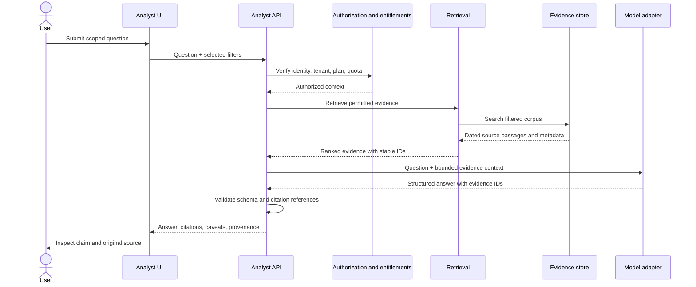

# AI Analyst architecture

## Current state

`services/analyst.py` can request structured JSON from OpenRouter when configured, or
return a deterministic sample answer otherwise. Neither route retrieves live sources or
provides citations. The UI labels both states. Treat all output as unverified.

## Proposed request flow

## Response contract

Return summary; key claims each mapped to one or more evidence IDs; risks/uncertainties;
recommended verification steps; retrieval time/window; model identifier; and an explicit
status (`grounded`, `partial`, `insufficient_evidence`, or `error`). Do not accept model
invented URLs or evidence identifiers. Resolve citations from server-side retrieved
records. If material claims lack support, abstain or label them as hypotheses.

## Quality and safety

- Defend against prompt injection in retrieved documents; source text is data, not
  instruction.
- Apply access filters before retrieval and test cross-tenant isolation.
- Limit input/output tokens, request rate, concurrency, retries, and cost per user.
- Evaluate citation entailment, completeness, freshness, contradiction handling,
  refusal/abstention, latency, and consistency using a reviewed test set.
- Version prompts, models, retrieval configuration, and evaluation results.
- Keep human review available for executive or high-impact reports.
- Never represent generated business analysis as guaranteed outcome or investment advice.

## Rollout

Begin with offline evaluation and internal review, then limited opt-in beta. Keep the
current sample mode visibly distinct; do not present it as live research. Gate general
availability on agreed evaluation thresholds and incident/cost controls.
