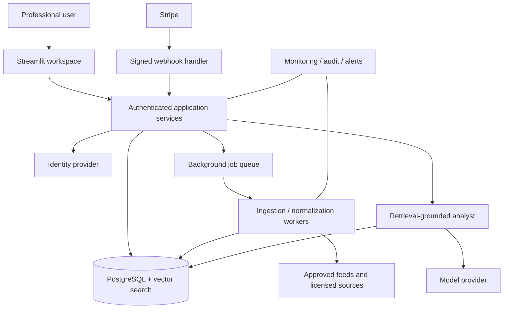
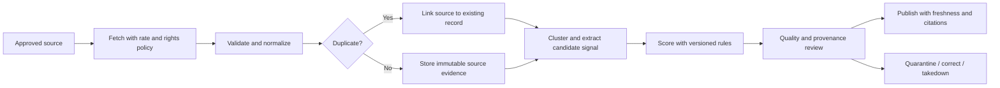
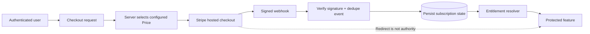

# Architecture diagrams

Mermaid diagrams here are design proposals. The [editable Draw.io diagram](diagrams/DOST_ALPHA_Architecture.drawio)
shows the same target boundaries. The existing app remains the prototype described in
the [audit](APPLICATION_AUDIT.md).

## System context

## Signal lifecycle

## Paid entitlement

