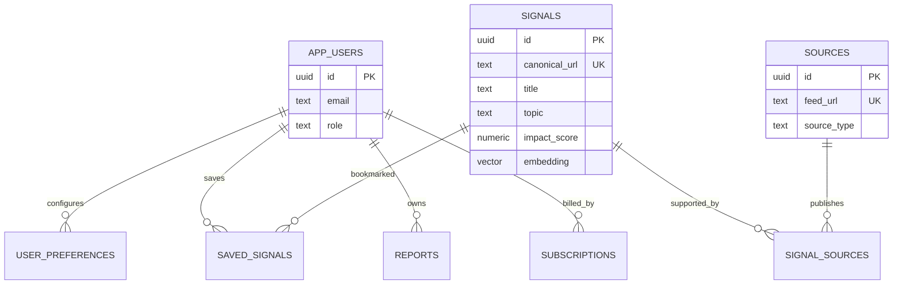

# Database schema

## Existing starting point

`database/schema.sql` enables `pgcrypto` and `vector` and defines:

- `app_users` with email, display name, and member/admin role.
- `sources`, `signals`, and the `signal_sources` provenance join.
- `user_preferences`, `saved_signals`, `reports`, and `subscriptions`.
- Topic/published, impact, and report-owner indexes.

The `signals` table includes score fields and a `vector(1536)` embedding. Confirm that
dimension against the chosen embedding model. The schema is a starting DDL file, not a
versioned migration or connected database; it does not by itself provide authentication
or tenant authorization.

## Production design considerations

1. Add versioned, forward-only migrations with rollback/repair procedures.
2. Decide whether user identity is owned by a managed provider; if so, store provider
   subject IDs and avoid treating email as the stable identity key.
3. Add organizations/memberships and tenant ownership before team features.
4. Store canonical source metadata and immutable article/evidence versions, fetch status,
   content hashes, licensing/retention metadata, and correction/takedown state.
5. Persist analyst runs, model/prompt/retrieval versions, evidence links, usage ledger,
   and idempotent billing events.
6. Add `created_at`/`updated_at`, constraints, foreign-key delete policies, and query
   indexes based on measured access patterns.
7. Use row-level security only with carefully tested connection/session context; it does
   not replace application authorization tests.

## Relationship diagram

## Data governance

Set retention and deletion rules for raw content, reports, embeddings, and prompts.
Minimize stored personal data, encrypt connections and backups, scope queries to the
authenticated owner/tenant, and test export/deletion behavior end to end.
