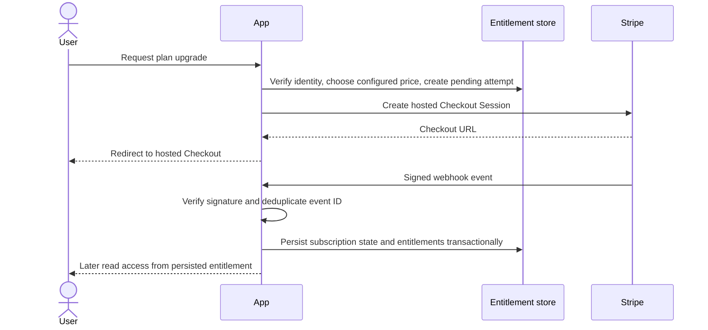

# Stripe integration guide

Stripe is not connected. The subscription page deliberately states that checkout is
unavailable; no payment method is collected by this prototype.

## Proposed lifecycle

## Required controls

- Create price IDs server-side from approved configuration; never accept arbitrary price
  IDs from the client.
- Verify webhook signatures against the exact raw request body and configured secret.
- Persist event IDs with a unique constraint; process retries idempotently.
- Handle out-of-order and duplicate events; reconcile subscription state with Stripe as
  needed.
- Grant capabilities only from verified persisted state, not redirect query parameters.
- Handle checkout completion, renewal, payment failure, cancellation, plan change,
  refund, and customer portal events with explicit state transitions.
- Keep secret keys in a secret manager; use restricted keys and separate test/live mode.
- Provide customer portal, clear renewal/cancellation details, receipts, support and
  applicable tax/legal handling.

## Test matrix

Test duplicate delivery, invalid signature, timeout/retry, out-of-order events, unpaid
checkout, failed renewal, cancellation at period end, immediate cancellation, refund,
plan switch, unknown price, and subscription lookup failure. Paid access must remain
consistent and recoverable after each case.

Have payment, tax, privacy, and consumer-protection obligations reviewed for target
markets before launch.
