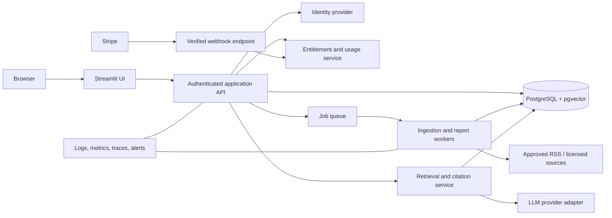

# Technical architecture

## Current architecture (implemented)

The Streamlit entry point routes to page functions. Pages use reusable UI components and
deterministic services. Demo content is local static data; an optional OpenRouter request
is made directly by the Analyst service. A PostgreSQL/pgvector schema file and Dockerfile
exist, but the app does not currently connect to the database, an ingestion worker, an
auth service, or Stripe.

## Target architecture (planned)

## Boundaries and rules

- UI handles presentation and input; server-side services enforce authorization and
  entitlements.
- Ingestion and long-running jobs run outside Streamlit request/session state.
- Persist original provenance and normalized evidence before generated summaries.
- Treat external feeds and model output as untrusted inputs.
- Use provider adapters, bounded timeouts, retries only for safe/idempotent operations,
  rate limits, and explicit cost budgets.
- Keep tenant IDs from authenticated context; do not trust a client-supplied owner ID.
- Store secrets in the deployment secret manager, never browser code or committed files.

## Deployment topology

Start with the Streamlit container plus a separately deployable API/worker and managed
PostgreSQL, using private networking where available. Add a managed queue when background
jobs require it. Streamlit Cloud is suitable for a UI prototype, not a substitute for
the full production data/auth/billing architecture described here.

## Observability

Record request/job IDs, source fetch status, model/provider/version, latency, token/cost
estimates, citation records, and error categories. Avoid logging secrets, full sensitive
prompts, or user data without a reviewed retention/consent policy. Alert on ingestion
staleness, repeated job failures, provider spend, webhook lag, and service availability.
